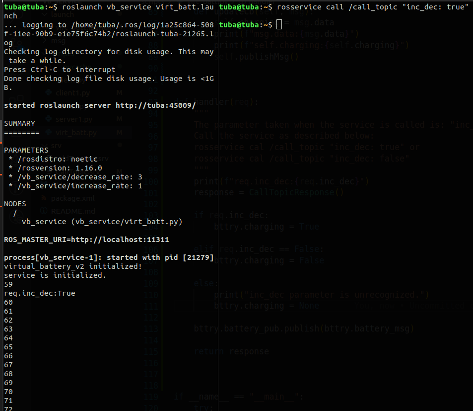
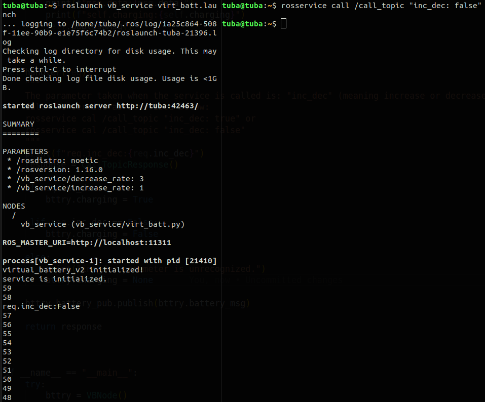

# Virtual Battery Simulation using ROS with Services Included
- The topic is called by a service.
- ROS timer callbacks are adopted.
- `increase_rate`, `decrease_rate`, `current_batt_level`, and `is_charging` parameterse are can be observed with `rostopic echo /status_pub` on another terminal.
- battery level is started from 60%.

## Running the main launch file (in 1st terminal):
- `roslaunch ROS_virt_batt_service virt_batt.launch`

## Calling the service (in 2nd terminal):
- `rosservice call /call_topic "inc_dec: true"` (the level of the battery is increased) or 
- `rosservice call /call_topic "inc_dec: false"` (the level of the battery is decreased).

## The results will be obtained by running above commands:

## Note: 
This repo is connected with [Virtual Battery Concept](https://github.com/tubaknr/virtual_battery_v2). 

